# gcp-secure-cloudrun-api-terraform

A secure Flask API deployed to **Google Cloud Run** with container build/push via **Cloud Build** + **Artifact Registry**, and infrastructure managed with **Terraform**.

## Project info

- **Service name:** `sentinal-api`
- **Region:** `europe-west2`
- **Terraform project:** `gcp-secure-cloudrun-api-tf`
- **Runtime:** Cloud Run (container)
- **Framework:** Flask + Gunicorn
- **Endpoints:**
  - `/` → `{"status":"Sentinal API running"}`
  - `/health` → `{"status":"ok"}`

---

## ✅ What this project demonstrates

- Cloud Run deployment (serverless containers)
- Debugging a real production-like issue (404 due to project context mismatch)
- Artifact Registry image management
- Repeatable infrastructure (Terraform)
- Clear verification steps with curl

---

## 🧩 Architecture Overview

### Components
- **Cloud Run**: Runs the containerized Flask API
- **Cloud Build**: Builds container image from source
- **Artifact Registry**: Stores container images
- **IAM**: Controls who can invoke the service

### Request flow
1. Client sends HTTPS request to Cloud Run URL
2. Google Frontend routes to Cloud Run
3. Cloud Run starts container (if needed) and forwards request
4. Gunicorn serves the Flask app and returns JSON response

---

## 🐛 Deployment Debugging & Resolution (404 Fix)

### Problem
When accessing the Cloud Run service URL, requests returned:

- `HTTP 404 Page not found`

### Root cause
The service was deployed into one GCP project, but the URL was tested while the CLI was set to a different project.

Projects involved:
- `gcp-secure-cloudrun-api` (original)
- `gcp-secure-cloudrun-api-tf` (Terraform-managed)

Because the **gcloud project context** was wrong, the service appeared missing and the URL returned 404.

---

## 🔎 Diagnosis Commands 

```bash
# Check current gcloud project
gcloud config get-value project

# List Cloud Run services in the region
gcloud run services list --region europe-west2

# Confirm the service URL in the correct project
gcloud run services describe sentinal-api \
  --region europe-west2
  --format="value(status.url)"

---

## Resolution

### Switch gcloud to Terraform-managed project
gcloud config set project gcp-secure-cloudrun-api-tf

### Fix ADC quota project alignment (prevents quota confusion)
gcloud auth application-default set-quota-project gcp-secure-cloudrun-api-tf

---

## Verification (expect HTTP 200)

```bash
URL=$(gcloud run services describe sentinal-api \
  --region europe-west2 \
  --format="value(status.url)")

echo "$URL"

curl -i "$URL/"
curl -i "$URL/health"


---

```md
## Evidence (screenshots)

### 1) 404 before fix
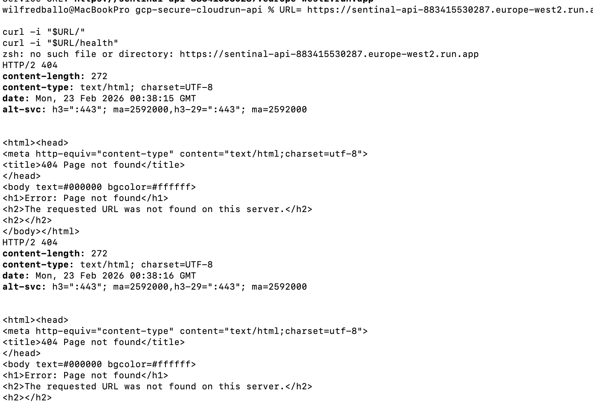

### 2) Wrong gcloud project context
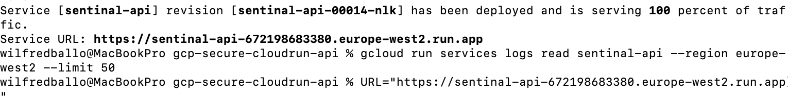

### 3) No Cloud Run services in tf project
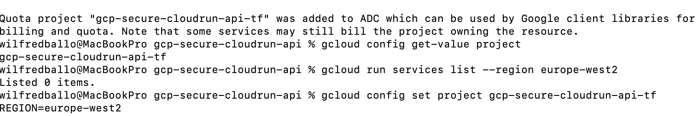

### 4) Correct project context
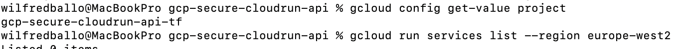

### 5) Successful Cloud Run deploy
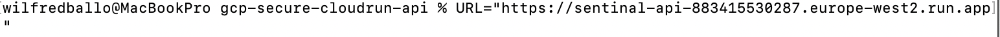

### 6) Root endpoint 200
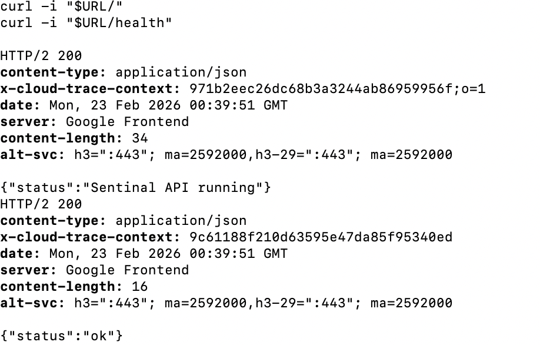

### 7) Cloud Run service overview
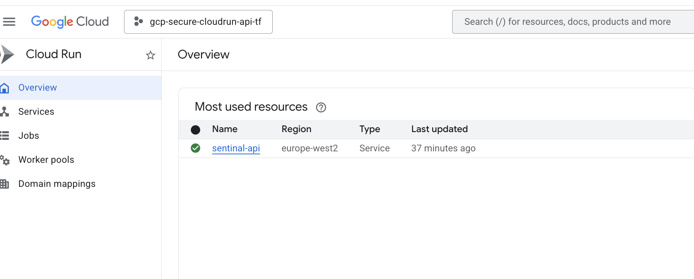

### 8) Cloud Run revision traffic
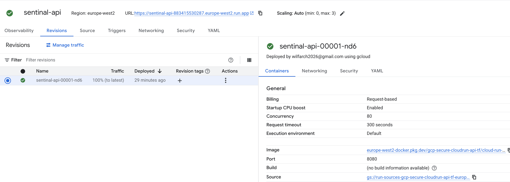

### 9) Cloud Build success
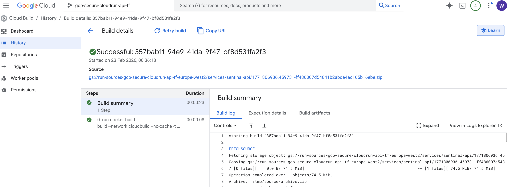

### 10) Artifact Registry IAM binding success
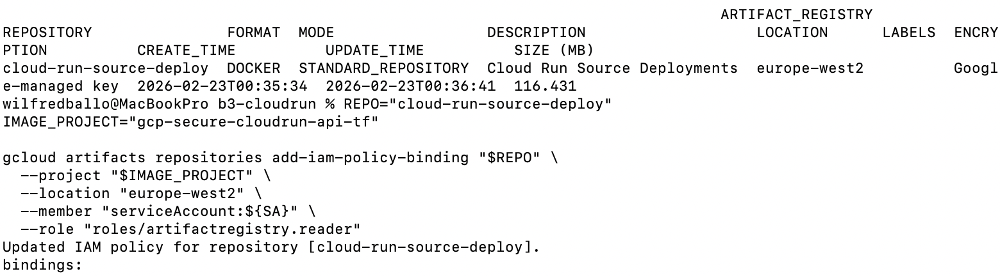

### 11) Terraform apply clean
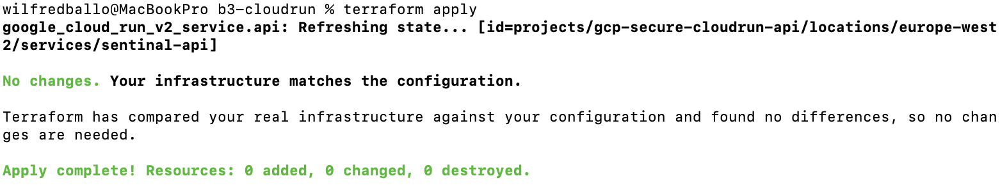

### 12) Terraform plan zero drift

