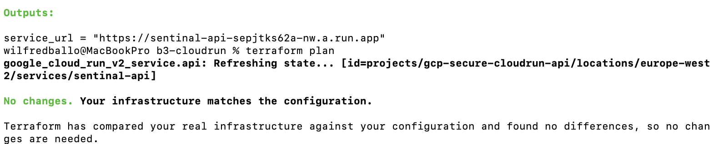

# GCP Secure Cloud Run API (Terraform)

Secure Flask API deployed to Google Cloud Run.
Built with Cloud Build + Artifact Registry.
Infrastructure managed with Terraform.

---

## What I built
A secure containerized Flask API deployed on **Cloud Run** and managed with **Terraform**.  
Images are built/pushed via **Cloud Build** into **Artifact Registry**.  

## Skills demonstrated
- GCP Cloud Run deployment + verification with `curl`
- Terraform-managed infrastructure and **drift validation**
- Debugging a real incident: **404 due to wrong project context**
- Debugging a real incident: **cross-project Artifact Registry permissions**
- IAM troubleshooting (service agents + repo-level IAM bindings)
- Using `gcloud` to inspect services, revisions, images, and logs

## Project Info

Service name: sentinal-api  
Region: europe-west2  
Terraform project: gcp-secure-cloudrun-api-tf  
Runtime: Cloud Run  
Framework: Flask + Gunicorn  

Endpoints:
- / → {"status":"Sentinal API running"}
- /health → {"status":"ok"}

---

## Architecture Overview

**Request flow**
1. Client calls Cloud Run URL (`/` and `/health`)
2. Cloud Run routes to the container (Flask + Gunicorn)
3. Container image is pulled from Artifact Registry
4. Terraform defines Cloud Run + IAM dependencies

**Key GCP services**
- Cloud Run (service: `sentinal-api`, region: `europe-west2`)
- Artifact Registry (Docker repo storing the container image)
- Cloud Build (build + push container image)
- IAM (service accounts + Cloud Run/Artifact Registry access)
- Terraform (infra as code + drift checks)

---

## Security Design

- Cloud Run ingress set to internal-only
- Service account explicitly defined
- Cross-project Artifact Registry access controlled via IAM binding
- No public unauthenticated access

---

## What This Project Demonstrates

- Real-world cloud debugging
- Cross-project IAM troubleshooting
- Terraform state management
- Cloud Run production deployment
- Understanding of GCP service agents

---

# Debugging Incident 1 — 404 Error

## Problem
Cloud Run URL returned HTTP 404.

## Root Cause
Wrong gcloud project selected.

Service deployed in:
gcp-secure-cloudrun-api-tf

CLI pointed to:
gcp-secure-cloudrun-api

## Fix
gcloud config set project gcp-secure-cloudrun-api-tf
gcloud auth application-default set-quota-project gcp-secure-cloudrun-api-tf

Result:
curl returned HTTP 200.

---

# Debugging Incident 2 — Artifact Registry Permission Denied

## Problem
terraform apply failed with:
artifactregistry.repositories.downloadArtifacts denied

## Root Cause
Cloud Run runtime service agent lacked read permission on Artifact Registry repository in image project.

## Fix

DEPLOY_PROJECT="gcp-secure-cloudrun-api"
PROJECT_NUM=$(gcloud projects describe "$DEPLOY_PROJECT" --format="value(projectNumber)")
SA="service-${PROJECT_NUM}@serverless-robot-prod.iam.gserviceaccount.com"

gcloud artifacts repositories add-iam-policy-binding cloud-run-source-deploy \
  --project gcp-secure-cloudrun-api-tf \
  --location europe-west2 \
  --member "serviceAccount:${SA}" \
  --role "roles/artifactregistry.reader"

Re-run:
terraform apply

Result:
Apply complete! Resources: 0 added, 0 changed, 0 destroyed.

---

## Reproduce (high level)
### Prereqs
- gcloud authenticated
- Terraform installed
- Project(s) created and billing enabled

### Deploy / Verify

# Confirm active project + region
gcloud config get-value project
gcloud run services list --region europe-west2

# Get service URL
URL=$(gcloud run services describe sentinal-api --region europe-west2 --format="value(status.url)")
echo "$URL"

# Verify endpoints
curl -i "$URL/"
curl -i "$URL/health"

---

## Key commands used during investigation
```bash
# Inspect service + revision + image
gcloud run services describe sentinal-api --region europe-west2 --format="yaml(status.url,status.latestReadyRevisionName)"
gcloud run revisions describe <REVISION> --region europe-west2 --format="yaml(spec.containers[0].image)"

# Logs (if needed)
gcloud run services logs read sentinal-api --region europe-west2 --limit 50

# Artifact Registry repos
gcloud artifacts repositories list --project <PROJECT_ID> --location europe-west2

# Terraform drift check
terraform plan

---

## Screenshots

### 404 Before Fix


### Wrong Project Context


### No Services In TF Project


### Successful Deploy


### HTTP 200 Success


### Artifact Registry IAM Binding Success


### Zero Drift Proof


All screenshots located in:

docs/screenshots/

